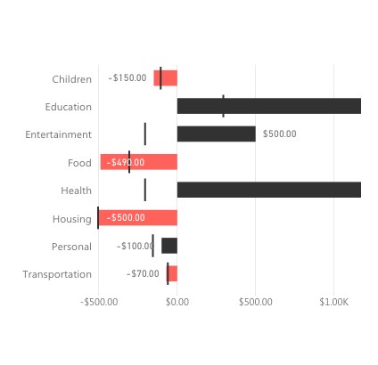

# Bullet Chart for Power BI

Inspired by Stephen Few, the Bullet Chart by OKViz allows you to show data values, saving precious space on your reports. It can render single or multiple values in a series and show comparison values, different targets, and performance areas. Horizontal and vertical mode included.

Find out more on https://okviz.com/bullet-chart/

## Changelog

A full changelog is available here: [CHANGELOG](/CHANGELOG.md)

## Submit an issue

To submit an issue, please visit [CONTRIBUTING](/CONTRIBUTING.md)

## Copyrights

Copyright (c) 2016-2018 OKViz - trademark of SQLBI Corp.

See the [LICENSE](/LICENSE) file for license rights and limitations (MIT).